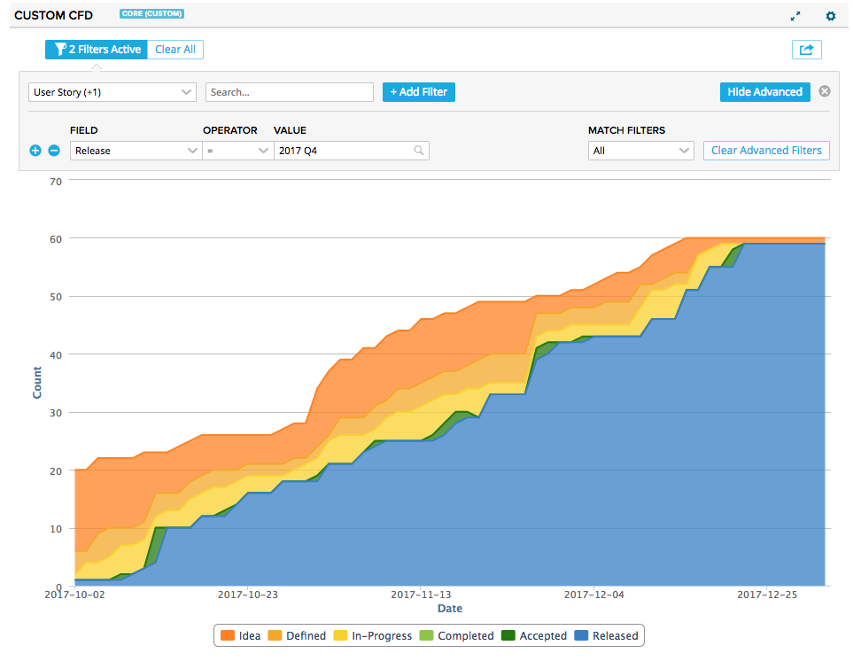
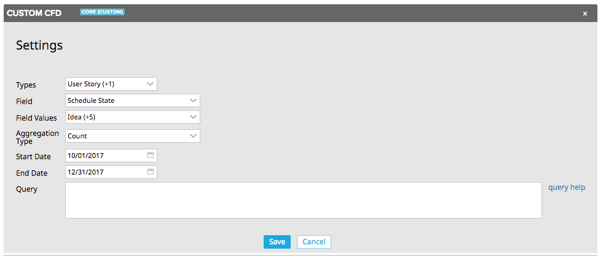

# Custom Cumulative Flow Diagram

This app is the cumulative flow chart equivalent of the [Custom Chart](https://github.com/RallyCommunity/CustomChart) app.  Pick one or more artifact types, a field to drive the chart (ScheduleState, or a custom field like KanbanState), and the field values you want to include and gain insight into your process via the generated chart.  Use the advanced filtering control to further slice and dice your data.  The computed CFD data is also exportable for more fine grained inspection.

## Installation and Settings
The app is installed as a Custom HTML App ([see help documentation](https://help.rallydev.com/custom-html))
Once the app is installed, use the gear menu on the app panel and select "Edit App Settings". There are a few settings you can configure for each chart type.

#### Types
Pick the artifact types to be included in the chart.  By default stories and defects are included.

#### Field
Pick the field to be used to drive the chart.  The default is Schedule State.

#### Field Values
Pick the values of the field chosen above to include in the chart.  This is especially useful if using a custom field which includes many values, not all of which apply to your team.

#### Aggregation Type
Pick how the data should be aggregated- via a simple count or by summing the plan estimates.

#### Start Date
The date at which the chart should begin.

#### End Date
The date at which the chart should end.

#### Query
In addition to the advanced filtering component in the app, you can write your own complex filter queries. [Extensive documentation](https://help.rallydev.com/grid-queries?basehost=https://rally1.rallydev.com) is available. This might be useful if you want to always limit the chart to certain complex criteria.